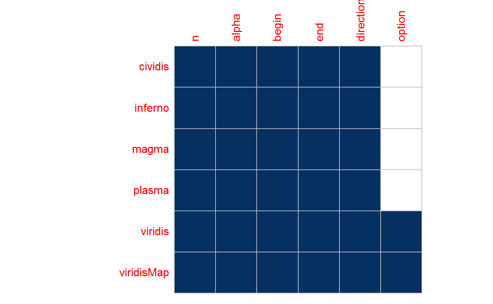

<!-- README.md is generated from README.Rmd. Please edit that file -->

[](https://www.tidyverse.org/lifecycle/#experimental)
[](https://travis-ci.org/ropenscilabs/pkginspector)
[](https://codecov.io/gh/ropenscilabs/pkginspector)

The goal of pkginspector is to inspect and better understand the
internal structure of an R package, with focus on facilitating package
reviews and [**rOpenSci**
onboarding](https://github.com/ropensci/onboarding).

## Installation

You can install pkginspector from GitHub with:

``` r
# install.packages("devtools")
devtools::install_github("ropenscilabs/pkginspector")
```

## Example

The inspected package must be stored locally and installed.

``` r
library(pkginspector)
```

``` r
path <- pkginspector_example("viridisLite")

knitr::kable(rev_fn_summary(path))
#> Warning in ls.str(pos = pos, envir = envir, mode = "function", ...):
#> partial argument match of 'all' to 'all.names'
```

| f\_name    | f\_args                                                                 | calls | called\_by | dependents |
| :--------- | :---------------------------------------------------------------------- | ----: | ---------: | ---------: |
| cividis    | cividis (n, alpha = 1, begin = 0, end = 1, direction = 1)               |     1 |          0 |          0 |
| inferno    | inferno (n, alpha = 1, begin = 0, end = 1, direction = 1)               |     1 |          0 |          0 |
| magma      | magma (n, alpha = 1, begin = 0, end = 1, direction = 1)                 |     1 |          0 |          0 |
| plasma     | plasma (n, alpha = 1, begin = 0, end = 1, direction = 1)                |     1 |          0 |          0 |
| viridis    | viridis (n, alpha = 1, begin = 0, end = 1, direction = 1, option = “D”) |     0 |          4 |          4 |
| viridisMap | viridisMap (n = 256, alpha = 1, begin = 0, end = 1, direction = 1,      |     0 |          0 |          0 |

``` r
args <- rev_args(path)
str(args, give.attr = FALSE)
#> List of 2
#>  $ arg_df :'data.frame': 6 obs. of  4 variables:
#>   ..$ arg_name                  : chr [1:6] "n" "alpha" "begin" "end" ...
#>   ..$ n_functions               : num [1:6] 6 6 6 6 6 2
#>   ..$ default_consistent        : logi [1:6] FALSE TRUE TRUE TRUE TRUE TRUE
#>   ..$ default_consistent_percent: num [1:6] 83.3 100 100 100 100 ...
#>  $ arg_map: logi [1:6, 1:6] TRUE TRUE TRUE TRUE TRUE TRUE ...

args$arg_df
#>    arg_name n_functions default_consistent default_consistent_percent
#> 1         n           6              FALSE                   83.33333
#> 2     alpha           6               TRUE                  100.00000
#> 3     begin           6               TRUE                  100.00000
#> 4       end           6               TRUE                  100.00000
#> 5 direction           6               TRUE                  100.00000
#> 6    option           2               TRUE                  100.00000

corrplot::corrplot(args$arg_map, method = 'square', cl.pos = "n")
```

<!-- -->
